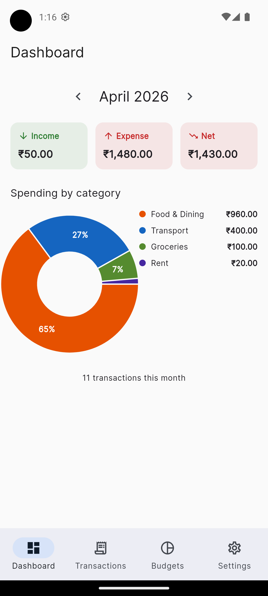
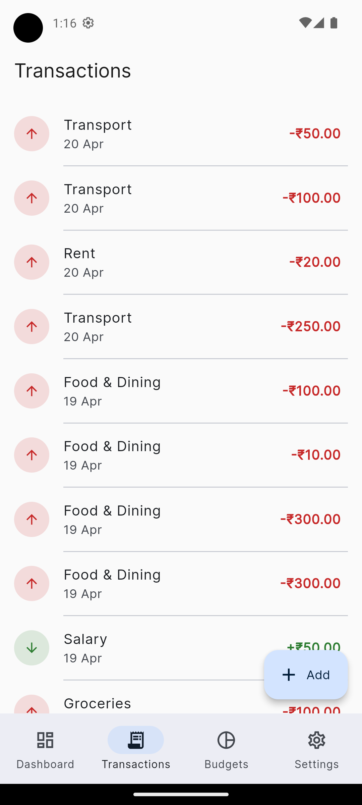
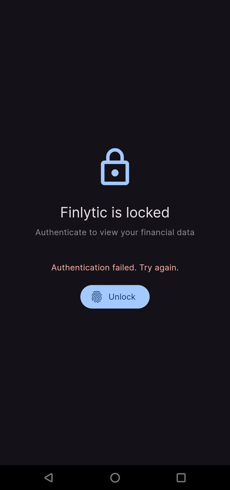

# Finlytic

A production-grade personal finance tracker built with Flutter, demonstrating Clean Architecture, reactive data flow, and fintech-appropriate engineering decisions.

> Portfolio project for SDE-2 mobile/cross-platform roles. Every commit is a deliberate architectural step — the [commit history](../../commits/main) reads like a walkthrough.

---

## Demo

<!-- TODO: replace with your actual GIF/screenshots after 9.4 -->


| Dashboard | Transactions | Budgets | Lock |
|---|---|---|---|
|  |  |  |  |

---

## What this project demonstrates

This isn't a CRUD tutorial. It's a deliberate showcase of patterns real fintech mobile teams use.

- **Clean Architecture** with feature-first organization and a strict dependency rule (domain depends on nothing)
- **Reactive data flow** end-to-end — Drift streams → Riverpod providers → Flutter widgets, with zero manual refresh logic
- **Type-safe money handling** via a `Money` value type with integer minor units (no floats, no cross-currency bugs)
- **Functional error handling** with `Result<T>` and a sealed `Failure` hierarchy, exhaustively matched at the UI layer
- **Biometric app lock** with lifecycle-aware re-auth on backgrounding, graceful fallback when unavailable
- **Production testing pyramid** — domain unit tests in pure Dart, data integration tests against in-memory SQLite

---

## Tech stack

| Concern | Choice | Reasoning |
|---|---|---|
| Framework | Flutter 3.24+ | Cross-platform, single codebase, mature ecosystem |
| Language | Dart 3.5+ | Null safety, records, sealed classes, pattern matching |
| State | Riverpod 2.x (code-gen) | Compile-safe, BuildContext-free, autodispose by default |
| Navigation | go_router | Declarative, type-safe, deep-link ready |
| Local DB | Drift (SQLite) | Type-safe SQL, reactive streams, migrations |
| Immutability | Freezed | Generated copyWith/==/hashCode, no mechanical boilerplate |
| Charts | fl_chart | Interactive, customizable, performant |
| Biometrics | local_auth | Platform-native Face ID / fingerprint |
| Reactive combinators | rxdart | combineLatest for multi-stream composition |

---

## Architecture

Clean Architecture with a strict dependency rule: **dependencies point inward**.

┌──────────────────────────────────────────────────┐
│  PRESENTATION                                    │
│  Flutter widgets, Riverpod providers, routes     │
│    │                                             │
│    │ depends on                                  │
│    ▼                                             │
│  ┌────────────────────────────────────────────┐  │
│  │  DOMAIN                                    │  │
│  │  Pure Dart. Business rules. No Flutter.    │  │
│  │  Entities, use cases, repository interfaces│  │
│  │    ▲                                       │  │
│  │    │ implements                            │  │
│  └────┼───────────────────────────────────────┘  │
│       │                                          │
│  ┌────┼───────────────────────────────────────┐  │
│  │  DATA                                      │  │
│  │  Drift-backed repository implementations,  │  │
│  │  mappers translating DB rows ↔ domain      │  │
│  └────────────────────────────────────────────┘  │
└──────────────────────────────────────────────────┘

**Folder layout:**
lib/
├── app/                    MaterialApp, router,theme
├── core/                   Cross-feature infrastructure
│   ├── database/           Drift schema + DAOs
│   ├── errors/             Failure sealed class
│   ├── types/              Money, Result
│   └── utils/              Formatters
├── features/
│   ├── transactions/       (one feature = one folder)
│   │   ├── data/           Drift-specific: impls, mappers, providers
│   │   ├── domain/         Pure Dart: entities, repo interfaces, use cases
│   │   └── presentation/   Flutter: screens, widgets, providers
│   ├── categories/
│   ├── accounts/
│   ├── budgets/
│   ├── dashboard/
│   ├── settings/
│   └── security/
└── shared/                 Widgets reused across features

Each feature is self-contained — you could literally extract `features/transactions/` into its own package.

---

## Key design decisions

### Money stored as integer minor units
`₹1,234.56` is stored as `123456` (paise). `double` is never used for money — IEEE 754 precision loss costs real money at fintech scale. A `Money` value type enforces same-currency arithmetic (cross-currency `+` throws).

### Typed errors via `Result<T>` and sealed `Failure`
Use cases never throw — they return `Result<T>` that's either `Success(data)` or `Err(failure)`. The sealed `Failure` hierarchy (validation / notFound / database / unknown) is pattern-matched exhaustively at the UI layer. Compile-time safety against ignored errors.

### Reactive streams over manual refresh
Drift's `watch()` queries return streams that re-emit when underlying data changes. Riverpod wraps them. Every screen subscribes. Adding a transaction automatically updates the list, dashboard summaries, pie chart, and budget progress bars — with zero explicit refresh code.

### One use case per file
`AddTransactionUseCase`, `UpdateTransactionUseCase`, `DeleteTransactionUseCase`... single responsibility at the class level. Easier DI, easier tests, easier deletion than a service class with 20 methods.

### Soft delete for referential integrity
Categories and accounts can't be hard-deleted — historical transactions reference them. Archiving hides them from pickers while preserving history.

### Biometric lock locks on background, not on timeout
Timeouts are annoying on an app you glance at often. Lock-on-background means "data disappears the moment the app isn't active." Strong security, low friction.

---

## Running the project

**Prerequisites**
- Flutter 3.24+
- Java 17 (for Android builds)
- Xcode 15+ (for iOS builds)

```bash
git clone https://github.com/<your-username>/finlytic.git
cd finlytic
flutter pub get
dart run build_runner build --delete-conflicting-outputs
flutter run
```

The first run seeds default accounts and categories. Add a few transactions, set a budget, toggle app lock in Settings, and try backgrounding the app.

---

## Testing

```bash
flutter test                    # all tests
flutter test --coverage         # with coverage
```

Testing strategy (pyramid):

- **Domain unit tests** (`test/features/*/domain/`) — pure Dart, no Flutter, no DB. Milliseconds to run. Covers validation rules, money arithmetic, entity invariants.
- **Data integration tests** (`test/features/*/data/`) — exercises repository implementations against in-memory SQLite. Proves DB mapping and reactive streams work.
- **Widget tests** (planned) — UI behavior with mocked providers.

---

## Roadmap

- [x] Project scaffold with Clean Architecture
- [x] Drift schema with migrations and seed data
- [x] Transactions feature (CRUD + streams)
- [x] Dashboard with summary cards and interactive pie chart
- [x] Budgets with animated progress bars
- [x] Categories management
- [x] Theme mode (light/dark/system)
- [x] Biometric app lock
- [ ] CSV export/import
- [ ] Multi-account balance tracking with transfers
- [ ] Monthly trend line chart
- [ ] Recurring transactions
- [ ] AI-powered spending insights (LLM integration)

---

## Engineering notes I'd expect interviewers to ask about

**Q: Why Riverpod over BLoC?**
Compile-time safety, no BuildContext requirement, less boilerplate, autodispose by default. BLoC is still big in older enterprise codebases — the patterns transfer easily — but for a new project Riverpod is the modern default.

**Q: How is the UI reactive?**
Drift `watch()` queries are streams. Riverpod wraps them in `StreamProvider`. Dashboard summaries are derived providers that read those streams. Inserting a transaction invalidates every watcher of the transactions table; new values flow through derived providers automatically; consuming widgets rebuild. No manual refresh.

**Q: How would you add backend sync?**
Add a second `TransactionRepository` implementation (remote API) and a sync coordinator. Local Drift stays the source of truth for UI; remote is eventually consistent. Domain layer unchanged because it depends on the repository interface, not the implementation.

**Q: How would you handle schema migrations?**
Drift's built-in migration system. Bump `schemaVersion`, add `onUpgrade` handler with `ALTER TABLE` calls. For complex migrations, write integration tests that upgrade v1→v2 with realistic data.

**Q: What's the weakest part?**
- Budget progress calculation lives in the data-layer provider rather than as a domain use case — should be extracted for testability.
- No offline/online sync yet.
- No encryption at rest for the SQLite file — acceptable for a portfolio demo, not for production. Would add SQLCipher for real.

---

## License

MIT

## Author

**<TODO:  Kushal Roy>** — transitioning to SDE-2, building the full-stack portfolio.

[LinkedIn](https://www.linkedin.com/in/kushal-roy-39414b193/) · [GitHub](https://github.com/kushalry)
